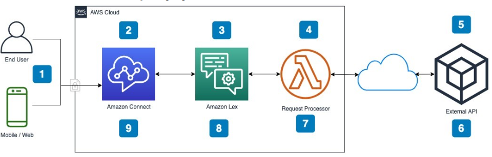
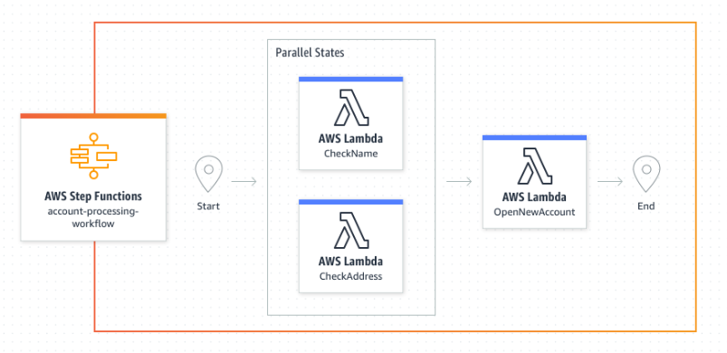
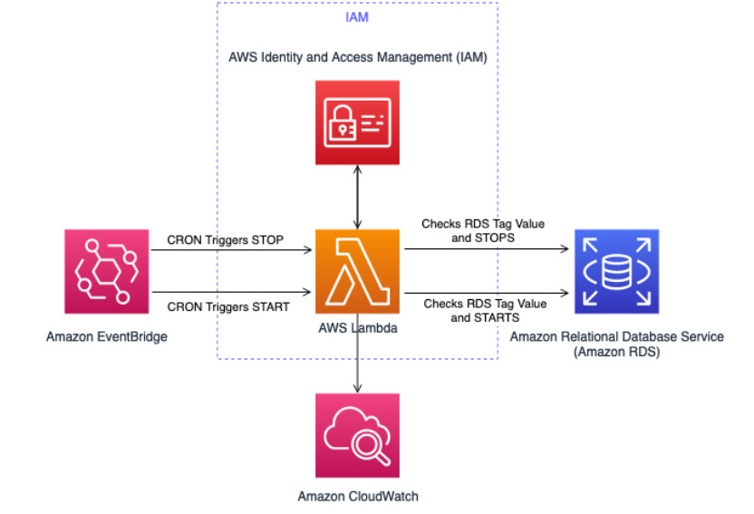

# RELATÓRIO DE IMPLEMENTAÇÃO DE SERVIÇOS AWS

Data: 24/08/2023
Empresa: Abstergo Industries 
Responsável: Cassia Maciel Watakabe

## Introdução
Este relatório apresenta o processo de implementação de ferramentas na empresa **Abstergo Industries**, realizado por **Cassia Maciel Watakabe**. O objetivo do projeto foi elencar 3 serviços AWS, com a finalidade de realizar diminuição de custos imediatos.

## Descrição do Projeto
O projeto de implementação de ferramentas foi dividido em 3 etapas, cada uma com seus objetivos específicos. A seguir, serão descritas as etapas do projeto:

Etapa 1: 
- **Amazon Lex**
- Amazon Lex é um serviço para criar interfaces conversacionais usando voz e texto. A Abstergo Industries poderia usar o Lex para criar um chatbot que ajuda os clientes a encontrar informações sobre produtos, fazer pedidos ou agendar consultas.
- Abstergo Industries poderia criar um chatbot de atendimento ao cliente com Amazon Lex. Esse chatbot poderia ser programado para responder a perguntas frequentes, como informações sobre produtos, preços e disponibilidade. Além disso, o chatbot poderia ser integrado ao sistema de pedidos da distribuidora, permitindo que os clientes façam pedidos diretamente pelo chatbot. Isso poderia melhorar a experiência do cliente e aumentar a eficiência do processo de atendimento ao cliente.

Etapa 2: 
- **AWS Step Functions**
- AWS Step Functions permite coordenar múltiplas funções do AWS Lambda em fluxos de trabalho visuais. Uma farmácia poderia usar o Step Functions para automatizar processos como o preenchimento de receitas ou a gestão do estoque.
- **Abstergo Industries** pode usar **AWS Step Functions** por exemplo, para um fluxo de trabalho para gerenciar o processo de pedidos, desde a recepção do pedido até a entrega ao cliente. O fluxo de trabalho poderia incluir etapas como validação do pedido, verificação da disponibilidade do produto, processamento do pagamento e envio do pedido. Isso poderia melhorar a eficiência do processo de pedidos e reduzir erros humanos. Além disso, o AWS Step Functions oferece opções de fluxo de trabalho padrão e expresso, permitindo que você escolha a opção mais adequada para o uso.

Etapa 3: 
- **Amazon RDS**
- Amazon Relational Database Service (RDS) facilita a configuração, operação e dimensionamento de um banco de dados relacional na nuvem. Uma farmácia poderia usar o RDS para gerenciar seus dados de clientes e inventário, bem como para gerar relatórios e análises.
- A distribuidora **Abstergo Industries** pode utilizar o **Amazon RDS** para criação e gerenciamento de um banco de dados relacional para armazenar informações sobre produtos, pedidos e clientes. O Amazon RDS é um serviço gerenciado que facilita a configuração, operação, escalabilidade de bancos de dados relacionais na nuvem, backup, recuperação e patching, permitindo que a distribuidora se concentre em suas atividades principais. Pode-se eliminar altos custos de licenciamento migrando para o PostgreSQL no Amazon RDS, essa mudança pode compensar eliminando taxas de licença e reduzindo a sobrecarga de gerenciamento.

## Conclusão
A implementação de ferramentas na empresa **Abstergo Industries** tem como esperado **Amazon Lex**, **AWS Step Functions**, **Amazon RDS**, o que aumentará a eficiência e a produtividade da empresa. Recomenda-se a continuidade da utilização das ferramentas implementadas e a busca por novas tecnologias que possam melhorar ainda mais os processos da empresa.

## Anexos

### Amazon Lex

### AWS Step Functions

Amazon RDS

Assinatura do Responsável pelo Projeto:

Cássia Maciel Watakabe