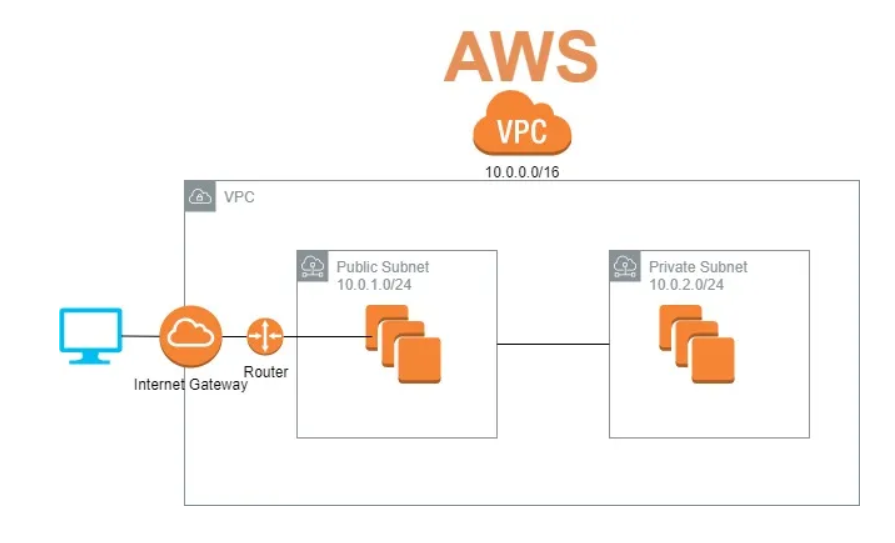
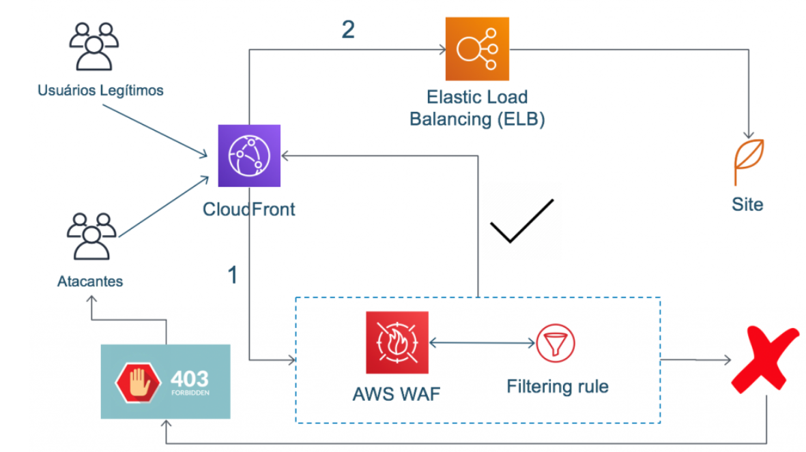
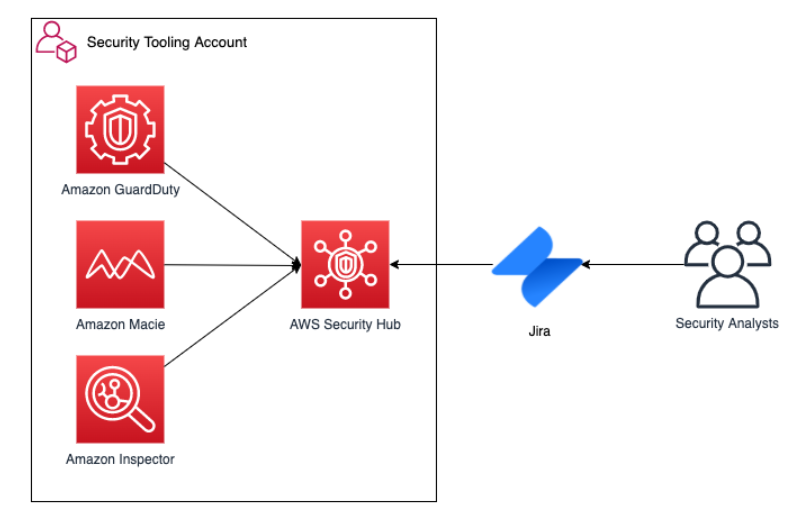

# RELATÓRIO DE IMPLEMENTAÇÃO DE MEDIDAS DE SEGURANÇA

Data: 24/08/2023
Empresa: Abstergo Industries 
Responsável: Cassia Maciel Watakabe

## Introdução
Este relatório apresenta o processo de implementação de ferramentas na empresa **Abstergo Industries**, realizado por **Cassia Maciel Watakabe**. O objetivo do projeto foi elencar 3 medidas de segurança em conjunto dos serviços da AWS, com a finalidade de realizar aumentar a segurança na empresa.

## Descrição do Projeto
O projeto de implementação de ferramentas foi dividido em 3 medidas de segurança. A seguir, serão descritas as etapas da implementação:

Etapa 1: 
- **Amazon VPC**
- Permite que você provisione uma seção isolada da nuvem da AWS onde você pode lançar recursos da AWS em uma rede virtual definida por você
- **Abstergo Industries** com *Amazon VPC* pode configurar um gateway NAT público para permitir que instâncias em uma sub-rede privada enviem tráfego para a Internet, enquanto impede que a Internet estabeleça conexões com essas instâncias e pode usar o *Amazon VPC* para acessar sua rede de endereços IP permitidos.

Etapa 2: 
- **AWS WAF**
- É um firewall de aplicativo web que ajuda a proteger suas aplicações web ou APIs contra explorações comuns da web. 
- **Abstergo Industries** pode usar *AWS WAF* por exemplo, para ajudar a proteger suas aplicações e APIs contra bots e explorações que consomem recursos, distorcem métricas ou causam tempo de inatividade. Fornece grupos de regras específicos de caso de uso que fornecem proteção incremental para muitos casos de uso diversificados e pode ajudar a evitar a injeção remota de consultas não autorizadas.

Etapa 3: 
- **Amazon Inspector**
- É um serviço automatizado de avaliação de segurança que ajuda a melhorar a segurança e conformidade de aplicações implantadas na AWS.
- A distribuidora **Abstergo Industries** pode utilizar o *Amazon Inspector*  pode ajudar a verificar a existência de vulnerabilidades e não conformidades em seus aplicativos instalados em seu sistema operacional através da instalação e execução de um agente em máquinas na nuvem e pode detectar automaticamente vulnerabilidades de software e exposição não intencional da rede. E também pode fornecer informações atuais sobre vulnerabilidades e exposições comuns

## Conclusão
A implementação de ferramentas na empresa **Abstergo Industries** tem como esperado **Amazon VPC**, **AWS WAF**, **Amazon Inspector**, o que aumentará a eficiência e a produtividade da empresa. Recomenda-se a continuidade da utilização das ferramentas implementadas e a busca por novas tecnologias que possam melhorar ainda mais os processos da empresa.

## Anexos

### Amazon VPC

### AWS WAF

### Amazon Inspector

Assinatura do Responsável pelo Projeto:

Cássia Maciel Watakabe